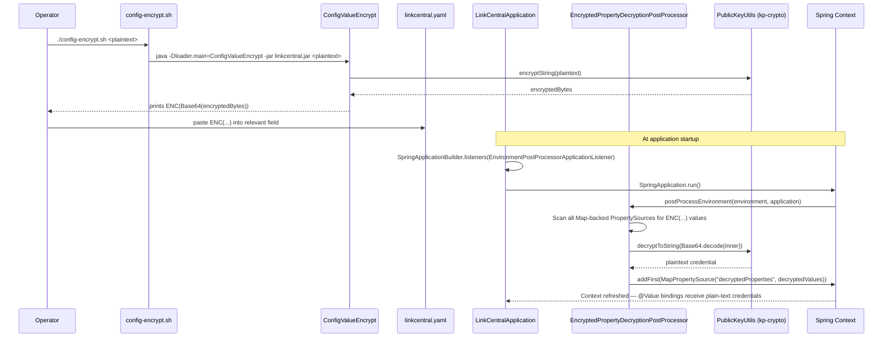

## PR #42785 — Implement encryption and decryption for sensitive configuration values

| Field | Value |
|---|---|
| **Status** | Draft |
| **Author** | Laks Yalamati |
| **Branch** | `feature/ado-997436-secure-secrets` → `main` |
| **Created** | 28 May 2026 |
| **Linked Work Item** | [ADO-997436](https://dev.azure.com/advantive-devops/Advantive/_workitems/edit/997436) — Implement Secure Secret Handling and Setup Wizard for KP-Xmit-LinkCentral Configuration |
| **Merge Status** | Succeeded |
| **Reviewers** | None assigned |

---

## Summary

KP-Xmit-LinkCentral previously stored sensitive credentials (database username/password, keystore password, and KiwiPlan comms credentials) as plain-text values in `linkcentral.yaml`, either hard-coded or resolved from environment variables at deploy time. This PR eliminates plain-text secrets from deployed configuration by introducing an `ENC(...)` encryption pattern backed by the existing `kp-crypto` library (`PublicKeyUtils`). At startup, a new `EnvironmentPostProcessor` transparently decrypts all `ENC(...)` values before any bean is created, requiring no changes to the business logic or existing `@Value`/`@ConfigurationProperties` bindings. A companion utility class and shell script (`config-encrypt.sh`) give operators a simple, single-command workflow to produce the encrypted values required by each YAML field. This is the first incremental delivery of ADO-997436; the interactive setup wizard portion of that work item is not included in this PR.

---

## What Changed

### New Classes / Components

#### `EncryptedPropertyDecryptionPostProcessor.java`

- **Purpose**: Decrypts all `ENC(...)` property values in the Spring `Environment` before bean creation, so downstream code always receives plain-text credentials.
- **Behavior**:
  - Implements `EnvironmentPostProcessor`, which runs as part of Spring Boot's environment preparation phase — before `@Value` and `@ConfigurationProperties` bindings are resolved.
  - Iterates every `PropertySource` whose backing object is a `Map`, scanning each string entry for the `ENC(` prefix and `)` suffix.
  - Decrypts matched values using `PublicKeyUtils.decryptToString()` after Base64-decoding the inner content.
  - Collects all decrypted key/value pairs and inserts them as a new `MapPropertySource` named `decryptedProperties` at the **head** of the property source chain, ensuring decrypted values take precedence.
  - Logs the count of decrypted properties at INFO level, and logs the property *key* (never the value) at ERROR level on decryption failure.
- **Design decisions**:
  - Placed first (`addFirst`) in the property source list so decrypted values shadow any still-encrypted originals, which is idiomatic for Spring property override patterns.
  - Registered programmatically from `LinkCentralApplication` rather than via `spring.factories` to keep the wiring visible and avoid classpath scanning surprises.
  - Guard clauses (`continue`) flatten the loop rather than nested `instanceof` conditionals, following an Aikido code-quality recommendation that was resolved before merge.
- **Security note**: Decryption errors log the property name only — never the encrypted bytes or any partially decrypted value. The actual credential is never observable in logs.

---

#### `ConfigValueEncrypt.java`

- **Purpose**: Alternate main-class entry point that encrypts a single plaintext argument and prints the `ENC(...)` string to stdout for manual use in `linkcentral.yaml`.
- **Behavior**:
  - Accepts exactly one non-blank argument; exits with an error and usage message otherwise.
  - Calls `PublicKeyUtils.encryptString(plaintext)`, Base64-encodes the resulting bytes, and wraps the result in `ENC(...)`.
  - Exposes a package-visible `encrypt(String)` method so the test class can verify round-trip correctness without spawning a subprocess.
- **Design decisions**:
  - Intentionally thin — no Spring context, no configuration — because it must run standalone via `java -Dloader.main=... -jar linkcentral.jar`.
  - The `static String encrypt(String)` helper is not `public` to avoid accidental API surface while still permitting direct test coverage.
  - RSA+DES encryption (used by `PublicKeyUtils`) is non-deterministic; encrypting the same value twice produces different ciphertext. This is verified explicitly in `ConfigValueEncryptTest`.

---

#### `config-encrypt.sh`

- **Purpose**: Operator-facing shell script that wraps `ConfigValueEncrypt` so technicians do not need to hand-craft the `java -Dloader.main` invocation.
- **Behavior**:
  - Validates that `JAVA_HOME` is set and `linkcentral.jar` is present in the same directory.
  - Requires exactly one non-empty argument (the plaintext value to encrypt).
  - Delegates to `ConfigValueEncrypt.main` via `java -Dloader.main=com.kiwiplan.link.linkcentral.util.ConfigValueEncrypt -jar linkcentral.jar`.
  - Prints the `ENC(...)` result; operators copy-paste it into `linkcentral.yaml`.
- **Design decisions**: The script uses `${BASH_SOURCE%/*}` to locate `linkcentral.jar` relative to the script itself, not `$PWD`, ensuring correct resolution when run from any working directory.

---

### Modified Files

#### `pom.xml`

- Added property `<kp-crypto.version>3.0.0</kp-crypto.version>` and a new `com.kiwiplan.inf:kp-crypto:3.0.0` dependency to provide `PublicKeyUtils` for encryption/decryption.
- Changed the Spring Boot Maven plugin JAR layout from the default (`JAR`) to **`ZIP`**. This switches the launcher from `JarLauncher` to `PropertiesLauncher`, which supports the `-Dloader.main` system property. Without this change, `config-encrypt.sh` would fail to invoke `ConfigValueEncrypt` as an alternate main class.

#### `LinkCentralApplication.java`

- Registered `EncryptedPropertyDecryptionPostProcessor` as an `EnvironmentPostProcessor` listener on the `SpringApplicationBuilder` using `EnvironmentPostProcessorApplicationListener.with(EnvironmentPostProcessorsFactory.of(...))`. This ensures the post-processor runs during environment preparation, before any beans are initialised.
- Removed trailing whitespace from the `props` block (cosmetic).

#### `src/main/resources/sample/linkcentral.yaml-opal-bhs`

Fields changed:

- `server.ssl.key-store-password`: Replaced `${KIWI_KS_PASS}` with `ENC(PLACEHOLDER)` and added an inline comment directing operators to run `deploy/config-encrypt.sh` to generate the real value.
- `spring.datasource.username` / `spring.datasource.password`: Replaced `${KIWI_DB_USER:test}` / `${KIWI_DB_PASS:test}` with `ENC(PLACEHOLDER)` placeholders.
- `kiwiplan.comms.username` / `kiwiplan.comms.password`: Replaced hard-coded plain-text values (`remuser` / `secr8`) with `ENC(PLACEHOLDER)` placeholders — this removes the last hard-coded comms credentials from a customer-facing sample config.

#### `src/main/resources/sample/linkcentral.yaml-para`

Fields changed:

- `server.ssl.key-store-password`: Replaced `${KIWI_KS_PASS}` with `ENC(PLACEHOLDER)`.
- `spring.datasource.username` / `spring.datasource.password`: Replaced `${KIWI_DB_USER}` / `${KIWI_DB_PASS}` with `ENC(PLACEHOLDER)`.

#### `src/main/resources/sample/linkcentral.yaml-gopfert-stora`

Fields changed:

- `server.ssl.key-store-password`: Replaced `${KIWI_KS_PASS}` with `ENC(PLACEHOLDER)`.
- `spring.datasource.username` / `spring.datasource.password`: Replaced `${KIWI_DB_USER}` / `${KIWI_DB_PASS}` with `ENC(PLACEHOLDER)`.
- `kiwiplan.comms.username` / `kiwiplan.comms.password`: Replaced `${KIWI_COMMS_USER}` / `${KIWI_COMMS_PASS}` env-var references with `ENC(PLACEHOLDER)` — comms credentials now follow the encrypted pattern rather than passing env-var plain text through at runtime.

---

### New Tests

#### `EncryptedPropertyDecryptionPostProcessorTest.java`

| Test | Verifies |
|---|---|
| `isEncrypted_returnsTrue_forValidEncFormat` | Recognises a correctly formatted `ENC(...)` string as encrypted |
| `isEncrypted_returnsFalse_forPlainText` | Returns false for plain text, null, and a missing closing parenthesis — covering the three boundary cases of the guard logic |
| `extractBase64_returnsInnerContent` | Correctly strips the `ENC(` prefix and `)` suffix to yield the raw Base64 content |
| `postProcessEnvironment_decryptsEncValue_andMakesPlaintextAvailable` | Full round-trip integration: encrypts a value with `PublicKeyUtils`, wraps it in `ENC(...)`, injects it into a `MockEnvironment`, runs the processor, and asserts that the property is now the original plaintext |
| `postProcessEnvironment_leavesNonEncryptedValues_unchanged` | Confirms that non-encrypted properties survive the post-processing step without modification |

Covers happy path, null/edge cases, and a full integration round-trip. No mocking of the crypto library — uses real `PublicKeyUtils` calls.

---

#### `ConfigValueEncryptTest.java`

| Test | Verifies |
|---|---|
| `encrypt_producesEncWrappedValue_thatDecryptsToOriginal` | Confirms `encrypt()` produces an `ENC(...)` string whose inner bytes decrypt back to the original plaintext |
| `encrypt_differentCallsProduceDifferentCiphertext` | Asserts that two `encrypt("secret")` calls produce different ciphertext, validating that the non-deterministic RSA+DES behaviour is working as expected and not silently broken |
| `encrypt_specialCharacters_roundTrip` | Verifies special characters (`p@$$w0rd!#%^&*()`) survive the full encrypt→Base64→decode→decrypt cycle intact |

---

## Architecture / Flow Diagram

### Startup decryption sequence

---

## Notes

- **Draft PR**: Marked as draft. Not yet ready for final review. The setup wizard (interactive guided configuration prompts, AC items 1–2 and 7 of ADO-997436) is not included in this PR — only the encryption/decryption runtime mechanism is delivered here.
- **No reviewers assigned**: No human reviewers have been added. Consider assigning a peer reviewer before marking ready for merge.
- **Aikido Integration comments**: 2 automated code-quality threads were raised by the Aikido security scanner (thread IDs 340367 and 340368), both flagging nested conditionals in `postProcessEnvironment`. Both threads are resolved (`status: closed`) — the author addressed the feedback by replacing compound `instanceof` checks with early-continue guard clauses.
- **Partial delivery against ADO-997436**: This PR satisfies AC items 3–6, 8–9, and 12 (encrypted storage, `kp-crypto` usage, transparent runtime decryption, plain-text elimination, and comms credential clean-up in sample configs). AC items 1–2 (setup wizard with interactive prompts) and 7 (wizard supports re-edit after initial install) remain open.
- **Deployment prerequisites**: Operators deploying to a new site must run `deploy/config-encrypt.sh <value>` for each sensitive field in `linkcentral.yaml` (DB username, DB password, keystore password, comms username, comms password) and replace the `ENC(PLACEHOLDER)` values before starting LinkCentral. The existing `linkcentral.jar` must be built (`mvn package`) before the script can be used.
- **ZIP layout change**: Switching the Spring Boot JAR layout to `ZIP` is required for `PropertiesLauncher` support. Any CI/CD steps that verify the JAR manifest or use `JarLauncher` assumptions should be reviewed for compatibility.
