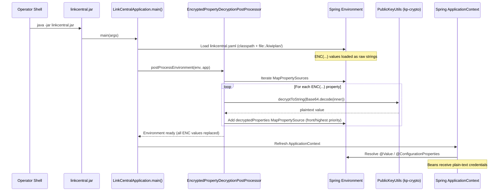
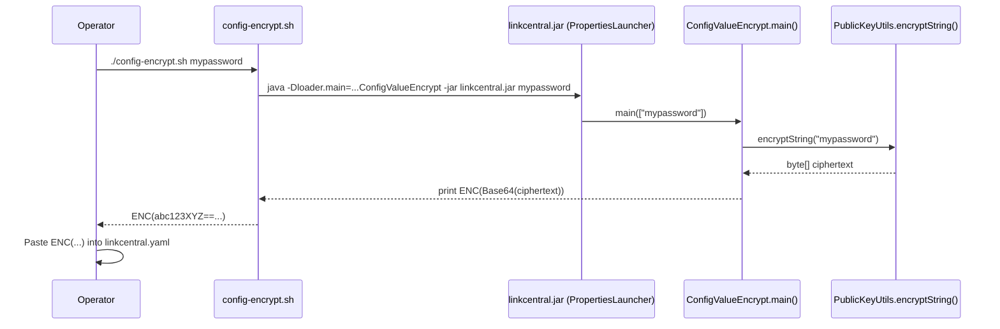

## PR #42785 — Implement encryption and decryption for sensitive configuration values

| Field | Value |
|---|---|
| **Status** | Draft (Active) |
| **Author** | Laks Yalamati |
| **Branch** | `feature/ado-997436-secure-secrets` → `main` |
| **Created** | 28 May 2026 |
| **Linked Work Item** | [ADO-997436](https://dev.azure.com/advantive-devops/Advantive/_workitems/edit/997436) — Implement Secure Secret Handling and Setup Wizard for KP-Xmit-LinkCentral Configuration |
| **Merge Status** | Succeeded |
| **Reviewers** | None assigned |

---

## Summary

KP-Xmit-LinkCentral previously stored sensitive credentials — database username/password, keystore password, and KiwiPlan comms credentials — as plain-text environment variables or hard-coded values in the deployed `linkcentral.yaml`. This PR eliminates plain-text secrets from deployed configuration by introducing an `ENC(...)` encryption pattern backed by the existing `kp-crypto` library (`PublicKeyUtils`). At startup, a new `EncryptedPropertyDecryptionPostProcessor` decrypts all `ENC(...)` values from the environment before any Spring bean is created, requiring zero changes to existing `@Value` or `@ConfigurationProperties` bindings. A companion shell script (`config-encrypt.sh`) and alternate-main utility (`ConfigValueEncrypt`) give technicians a single-command workflow to produce the encrypted values that replace plain-text fields in each site-specific YAML config file.

---

## What Changed

### New Classes / Components

#### `EncryptedPropertyDecryptionPostProcessor.java`
[src/main/java/com/kiwiplan/link/linkcentral/config/EncryptedPropertyDecryptionPostProcessor.java](../../../KP-Xmit-LinkCentral/src/main/java/com/kiwiplan/link/linkcentral/config/EncryptedPropertyDecryptionPostProcessor.java)

- **Purpose**: Spring `EnvironmentPostProcessor` that scans all loaded property sources for `ENC(...)` values, decrypts them using `PublicKeyUtils.decryptToString()`, and injects the plain-text results into a high-priority `MapPropertySource` before any bean is created.
- **Behavior**:
  - Iterates all `MapPropertySource` entries in the `ConfigurableEnvironment`.
  - For each entry, uses early-continue guard clauses to skip non-String and non-encrypted values, keeping the main decryption path flat and readable (Aikido-flagged nesting was resolved during review).
  - Decrypted values are collected into a new `decryptedProperties` `MapPropertySource` added at the **front** (highest priority) of the property source list, so `@Value` and `@ConfigurationProperties` bindings transparently receive plain text.
  - Failures to decrypt a specific key are logged at WARN level and the original encrypted value is left in place; startup is not aborted, preserving resilience.
  - Exposes static helpers `isEncrypted(String)` and `extractBase64(String)` for testability.
- **Design decisions**: Registered programmatically via `EnvironmentPostProcessorApplicationListener.with(EnvironmentPostProcessorsFactory.of(...))` in `LinkCentralApplication` rather than through `spring.factories`, avoiding classpath resource fragility. The `decryptedProperties` source is inserted at position 0 to ensure it wins over any environment variable or YAML source.
- **Security note**: Decrypted values are never logged. The processor catches and logs decryption errors by key name only; the encrypted ciphertext is not emitted to logs.

---

#### `ConfigValueEncrypt.java`
[src/main/java/com/kiwiplan/link/linkcentral/util/ConfigValueEncrypt.java](../../../KP-Xmit-LinkCentral/src/main/java/com/kiwiplan/link/linkcentral/util/ConfigValueEncrypt.java)

- **Purpose**: Alternate-main utility that encrypts a single plaintext value and prints the resulting `ENC(...)` string to stdout. Intended for technician use during deployment setup.
- **Behavior**:
  - Accepts exactly one non-blank command-line argument; prints usage to stderr and exits with code 1 if missing.
  - Calls `PublicKeyUtils.encryptString(plaintext)` and Base64-encodes the resulting bytes.
  - Wraps the encoded bytes in the `ENC(...)` format expected by `EncryptedPropertyDecryptionPostProcessor`.
  - Exposes a package-accessible static `encrypt(String)` method for unit testing.
- **Design decisions**: RSA+DES encryption via `PublicKeyUtils` is non-deterministic — two calls with identical input produce different ciphertext, which is intentional and verified by a test. This means encrypted config values cannot be diff-verified in version control, but provides stronger confidentiality. The utility is an alternate main invoked via `java -Dloader.main=...` rather than a separate JAR, eliminating the need to ship an additional artifact.
- **Security note**: The printed `ENC(...)` value should be treated as a secret at the shell/terminal level; the value itself protects the underlying credential through asymmetric encryption.

---

#### `config-encrypt.sh`
[src/main/resources/config-encrypt.sh](../../../KP-Xmit-LinkCentral/src/main/resources/config-encrypt.sh)

- **Purpose**: Shell convenience wrapper for technicians to encrypt a single configuration value without needing to know the Java invocation syntax.
- **Behavior**:
  - Validates that `JAVA_HOME` is set and `linkcentral.jar` is present in the script directory; exits with a descriptive error if either is missing.
  - Enforces exactly one non-empty argument.
  - Delegates to `ConfigValueEncrypt` via `java -Dloader.main=com.kiwiplan.link.linkcentral.util.ConfigValueEncrypt -jar linkcentral.jar`.
  - Prints the `ENC(...)` output directly to stdout for copy/paste into `linkcentral.yaml`.
- **Design decisions**: Uses `${BASH_SOURCE%/*}` for self-relative path resolution so the script works correctly when invoked from any directory. Dependency on `JAVA_HOME` (rather than `java` from PATH) ensures the same JVM used to build the JAR is used for encryption.

---

### Modified Files

#### `pom.xml`

- Added `kp-crypto` dependency (`com.kiwiplan.inf:kp-crypto:3.0.0`) with version property `<kp-crypto.version>3.0.0</kp-crypto.version>` to provide `PublicKeyUtils` at runtime.
- Added `<layout>ZIP</layout>` to the `spring-boot-maven-plugin` configuration, switching the repackaged JAR from the default `JAR` layout to `ZIP` (PropertiesLauncher). This is required to support `java -Dloader.main=<alternate-main>` invocations, enabling `ConfigValueEncrypt` to be run directly from the production JAR.

#### `LinkCentralApplication.java`

- Registered `EncryptedPropertyDecryptionPostProcessor` programmatically using `.listeners(EnvironmentPostProcessorApplicationListener.with(EnvironmentPostProcessorsFactory.of(EncryptedPropertyDecryptionPostProcessor.class)))` on the `SpringApplicationBuilder`. This ensures the post-processor runs during environment preparation, before any bean definition is processed. No `spring.factories` or `META-INF/spring/` registration is needed.
- Removed a trailing whitespace line; no functional change.

---

### New Tests

#### `EncryptedPropertyDecryptionPostProcessorTest.java`
[src/test/java/com/kiwiplan/link/linkcentral/config/EncryptedPropertyDecryptionPostProcessorTest.java](../../../KP-Xmit-LinkCentral/src/test/java/com/kiwiplan/link/linkcentral/config/EncryptedPropertyDecryptionPostProcessorTest.java)

| Test | Verifies |
|---|---|
| `isEncrypted_returnsTrue_forValidEncFormat` | Returns `true` for a well-formed `ENC(...)` string |
| `isEncrypted_returnsFalse_forPlainText` | Returns `false` for plain text, `null`, and unclosed `ENC(` strings |
| `extractBase64_returnsInnerContent` | Correctly strips the `ENC(` prefix and `)` suffix to yield the Base64 payload |
| `postProcessEnvironment_decryptsEncValue_andMakesPlaintextAvailable` | Full round-trip: encrypts a value, places it as `ENC(...)` in a `MockEnvironment`, runs `postProcessEnvironment`, and asserts the plain-text value is retrievable from the environment |

Covers the happy path, null/edge-case inputs, and a real decryption round-trip against the live `PublicKeyUtils`.

---

#### `ConfigValueEncryptTest.java`
[src/test/java/com/kiwiplan/link/linkcentral/util/ConfigValueEncryptTest.java](../../../KP-Xmit-LinkCentral/src/test/java/com/kiwiplan/link/linkcentral/util/ConfigValueEncryptTest.java)

| Test | Verifies |
|---|---|
| `encrypt_producesEncWrappedValue_thatDecryptsToOriginal` | Encrypted output starts with `ENC(`, ends with `)`, and decrypts back to the original plaintext via `PublicKeyUtils.decryptToString()` |
| `encrypt_differentCallsProduceDifferentCiphertext` | Two encryptions of the same input produce different ciphertext (confirming RSA+DES non-determinism) |
| `encrypt_specialCharacters_roundTrip` | Special characters (`p@$$w0rd!#%^&*()`) survive encrypt/decrypt without corruption |

Covers happy path, cryptographic non-determinism, and special-character edge cases.

---

### Configuration / Build Changes

#### `pom.xml`

- Added dependency: `com.kiwiplan.inf:kp-crypto:3.0.0` — provides `PublicKeyUtils.encryptString()` / `decryptToString()`.
- Changed `spring-boot-maven-plugin` layout from default (`JAR`) to `ZIP` — enables `PropertiesLauncher` and the `-Dloader.main` alternate-main pattern required by `config-encrypt.sh`.

---

### Sample / Reference Config Updates

Three site-specific sample configs were updated to replace plain-text and environment-variable credential fields with `ENC(PLACEHOLDER)` values, along with inline comments directing operators to run `deploy/config-encrypt.sh <value>` and paste the result.

#### `sample/linkcentral.yaml-opal-bhs`

Fields changed:

| Field | Before | After |
|---|---|---|
| `server.ssl.key-store-password` | `${KIWI_KS_PASS}` | `ENC(PLACEHOLDER)` |
| `spring.datasource.username` | `${KIWI_DB_USER:test}` | `ENC(PLACEHOLDER)` |
| `spring.datasource.password` | `${KIWI_DB_PASS:test}` | `ENC(PLACEHOLDER)` |
| `kiwiplan.comms.username` | `remuser` (hard-coded) | `ENC(PLACEHOLDER)` |
| `kiwiplan.comms.password` | `secr8` (hard-coded) | `ENC(PLACEHOLDER)` |

> Hard-coded comms credentials (`remuser` / `secr8`) are eliminated from this sample.

---

#### `sample/linkcentral.yaml-para`

Fields changed:

| Field | Before | After |
|---|---|---|
| `server.ssl.key-store-password` | `${KIWI_KS_PASS}` | `ENC(PLACEHOLDER)` |
| `spring.datasource.username` | `${KIWI_DB_USER}` | `ENC(PLACEHOLDER)` |
| `spring.datasource.password` | `${KIWI_DB_PASS}` | `ENC(PLACEHOLDER)` |

---

#### `sample/linkcentral.yaml-gopfert-stora`

Fields changed:

| Field | Before | After |
|---|---|---|
| `server.ssl.key-store-password` | `${KIWI_KS_PASS}` | `ENC(PLACEHOLDER)` |
| `spring.datasource.username` | `${KIWI_DB_USER}` | `ENC(PLACEHOLDER)` |
| `spring.datasource.password` | `${KIWI_DB_PASS}` | `ENC(PLACEHOLDER)` |
| `kiwiplan.comms.username` | `${KIWI_COMMS_USER}` | `ENC(PLACEHOLDER)` |
| `kiwiplan.comms.password` | `${KIWI_COMMS_PASS}` | `ENC(PLACEHOLDER)` |

---

## Architecture / Flow Diagram

### Startup Decryption Flow

### Config Value Encryption Workflow (Operator)

---

## Acceptance Criteria Coverage

| AC | Description | Status |
|---|---|---|
| AC 1 | Setup wizard implemented | ⚠️ Partial — `config-encrypt.sh` is a per-value tool, not an interactive wizard |
| AC 2 | Wizard prompts for all config values | ⚠️ Not yet — each field must be encrypted individually |
| AC 3 | Sensitive values no longer plain text in YAML | ✅ Covered |
| AC 4 | DB user/pass, comms user/pass, keystore pass are encrypted | ✅ Covered |
| AC 5 | Uses `KP-Library-Java-KiwiplanCryptography` | ✅ Covered (`kp-crypto:3.0.0`) |
| AC 6 | Runtime decryption before beans created | ✅ Covered (`EncryptedPropertyDecryptionPostProcessor`) |
| AC 7 | Wizard supports re-running for edits | ⚠️ Partial — `config-encrypt.sh` can re-encrypt any value; no guided re-run flow |
| AC 8 | Existing startup behavior preserved | ✅ Covered (no changes to business logic or existing bindings) |
| AC 9 | No changes required for LinkDevice or VLink-2.0 | ✅ Confirmed — not in scope |
| AC 10 | Documentation / usage notes added | ✅ Covered — inline YAML comments and script usage block |
| AC 11 | Validation that startup succeeds with encrypted credentials | ⚠️ Requires deployment testing |
| AC 12 | Hard-coded comms credentials removed | ✅ Covered (`remuser` / `secr8` replaced in gopfert-stora and opal-bhs) |

---

## Open Items / Notes

- **DRAFT PR**: This PR is marked as a draft. It should not be merged until the draft flag is removed.
- **No reviewers assigned**: No human reviewers have been added. Reviewers should be assigned before requesting merge.
- **AC 1 / AC 2 gap**: The work item requires an interactive setup wizard that prompts for all configuration values in a single guided flow. This PR delivers a per-value encryption utility (`config-encrypt.sh`) rather than a full wizard. AC 1, 2, and 7 are not fully addressed. This should be confirmed as accepted scope or tracked as a follow-up task.
- **Aikido comments**: Two code-quality threads were raised by Aikido Integration against `EncryptedPropertyDecryptionPostProcessor` (nested loop with compound conditional). Both were resolved and closed by the author during development.
- **Deployment prerequisite**: Operators must run `config-encrypt.sh` for each sensitive field and update their site-specific `linkcentral.yaml` before deploying this version. The `ENC(PLACEHOLDER)` values in sample configs are templates, not functional encrypted values.
- **PropertiesLauncher**: The `<layout>ZIP</layout>` change in `pom.xml` changes the JAR launcher class from `JarLauncher` to `PropertiesLauncher`. The startup command `java -jar linkcentral.jar` continues to work normally; there is no breaking change for the main application entry point.
- **Merge commit exists**: A merge commit (`7f6ad33`) has already been created — the merge simulation succeeded. The PR can be completed once it exits draft and reviewers approve.
