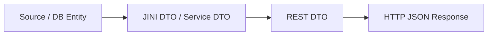

# ADO Implementation Plan Skill

## Purpose

You are a senior software engineer. Your job is to read a completed ADO research document,
deeply analyse the affected codebase, and produce a precise, code-level implementation plan
that a developer can follow step-by-step with no ambiguity.

The plan must be **immediately actionable**: every task must name the exact file, explain
the exact change, include code snippets or patterns, and reference existing conventions from
the codebase.

**Target audience:** The developer assigned to the ticket (often the person invoking this skill).

---

## Tool Assignments

| Concern | Tool |
|---|---|
| Codebase analysis and search | Repomix MCP (`pack_codebase`, `grep_repomix_output`, `read_repomix_output`) |
| ADO work item data (if needed) | ADO MCP (`get_work_item`) |
| File / directory creation | Filesystem MCP (`write_file`, `create_directory`) or built-in file tools |
| Code navigation | Built-in `grep_search`, `file_search`, `read_file` tools |
| Codebase exploration | `Explore` subagent for targeted deep-dives |

---

## Execution Rules

- State which step you are starting before beginning it.
- Proceed automatically after each step completes — do not pause unless input is genuinely missing.
- Create the output file at the start (Step 2) and update it incrementally — never batch all writes to the end.
- If `/ado-impl continue` is invoked, review recent chat history, find the last completed step, and resume from the next one.
- Do not speculate. If the research doc lacks sufficient code detail, use Repomix or the built-in search tools to fill the gaps before writing the plan.
- Follow all applicable instructions from `~/.copilot/instructions/` for the target repository (Java version rules, coding standards, testing requirements, security).

---

## Steps

### Step 0 — Prerequisites

1. **Resolve the work item ID** from the slash command argument (`/ado-impl 973277`). If no ID is provided, ask the user before proceeding.

2. **Locate the research document.** Search for a matching file:
   ```
   /home/laksyalamat/projects/git/ai-forge/outcomes/ado-research/ADO<id>-research-*.md
   ```
   If multiple files match, use the most recent one (latest timestamp in filename).
   If no file is found, warn the user: "No research document found for ADO `<id>`. Run `/research <id>` first."

3. **Identify the target repository.** Read the research document:
   - Check the **Module** field and any file paths cited under Code Questions.
   - Cross-reference with the repository map in `~/.copilot/instructions/my-projects-setup.instructions.md` to resolve the local path under `/home/laksyalamat/projects/`.
   - If the repository cannot be determined, ask the user.

4. **Confirm Java version** for the target repo using the Java Version Awareness section of `my-projects-setup.instructions.md`. Note it — all code examples in the plan must comply.

---

### Step 1 — Read and Digest Research

Read the full research document. Extract and internally track:

| Field | Purpose |
|---|---|
| Description / Acceptance Criteria | Defines the scope of work |
| Domain Questions + Answers | Business context and constraints |
| Code Questions (CQ1, CQ2, …) | Pinpoints affected files and classes |
| Recommended Next Steps | Starting point for task ordering |
| References / Design Docs | Additional context to fetch if needed |

If the research document has a "Recommended Next Steps" section, treat it as the **draft task list** and refine it using your codebase analysis in Step 2.

---

### Step 2 — Create Output File

1. Create the directory if it does not exist:
   ```
   /home/laksyalamat/projects/git/ai-forge/outcomes/ado-impl-plans/
   ```

2. Construct the filename using the current date-time:
   ```
   ADO<id>-implementation-plan-<YYYYMMDD-HHmmss>.md
   ```
   Each invocation creates a new timestamped file — never overwrite.

3. Initialise the file with the skeleton from [references/implementation-plan-template.md](references/implementation-plan-template.md).
   Populate only the header fields (work item ID, title, date, repo, Java version, research doc link).
   Leave all task sections as `[To be completed]` placeholders until Step 4.

---

### Step 3 — Analyse the Codebase

1. **Pack the target repository** using Repomix MCP (`pack_codebase`). Use the repo path identified in Step 0.
   - If the repository is very large (e.g., `KP-MapJava`), scope the pack to the relevant module path(s) identified in the research doc rather than the entire repo.

2. **Verify each file cited in the research document** still exists at the path stated. If paths have changed, resolve the correct current paths.

3. **Read all directly affected files** in full using `read_repomix_output` or `read_file`. Do not rely on summaries — read the actual code.

4. **Grep for related patterns** using `grep_repomix_output`:
   - Existing usages of classes/methods being changed
   - Test files covering the affected code
   - Any other callers or consumers that must stay compatible

5. **Identify additional ripple files** not mentioned in the research: callers, mappers, validators, converters, OpenAPI specs, test fixtures.

6. Record every file that requires a change, grouped by layer (e.g., model → service → mapper → controller → test → spec).

---

### Step 4 — Write the Implementation Plan

Update the output file with a complete implementation plan. For **each task**, follow this structure:

#### Task Template

```markdown
### Task N — [Short Action Title]

**File:** `path/to/file.java`
**Change type:** Add / Modify / Delete

#### What to change

[Precise description of the change. Reference the exact method, class, or field.]

#### Why

[One sentence: why this change is needed and what NLA/consumer requirement it satisfies.]

#### Code

[Before/after snippets, or add-only snippets, using the project's existing code style.]

#### Notes

[Any edge cases, null handling, backward-compatibility constraints, or gotchas.]
```

#### Ordering rules:

- Order tasks **bottom-up through the call stack**: model / DTO layer first, then service/mapper, then controller, then tests, then spec/docs.
- A task must be completable without depending on a later task.
- Flag any tasks that can be done in parallel.

---

### Step 5 — Write Supporting Sections

After the task list, append these sections to the output file:

#### Data Flow Diagram

Generate a Mermaid diagram showing the end-to-end data flow after the changes:



Adapt to the actual types and layers in this ticket.

#### Backward Compatibility Assessment

For each changed public interface (REST response, JINI DTO, public method signature), explicitly state:
- Whether the change is **additive**, **breaking**, or **behaviour-changing**.
- What existing consumers are affected and how.
- Whether a version bump is required.

#### Test Plan

List the specific test scenarios to add or update:

| Test Class | Test Method | What it verifies |
|---|---|---|
| `TestXxx` | `testNewField_withLineupEntry` | New field populated when lineup entry present |
| `TestXxx` | `testNewField_nullWhenNoLineup` | Default value when no lineup entry |

Follow the testing standards from `~/.copilot/instructions/testing-quality.instructions.md`:
- Line coverage target: 80%
- Branch coverage target: 70%
- Do not mock just to inflate coverage.

#### Dependencies and Risks

| Item | Type | Notes |
|---|---|---|
| Cross-module dependency | Dependency | e.g., `kp-pcs-api` change requires `kp-pcs-impl` rebuild |
| Null safety | Risk | Field X can be null in legacy data — needs guard |
| Consumer impact | Risk | Any existing NLA consumer that may be affected |

#### Out of Scope

Explicitly list anything **not** covered by this plan that was mentioned in the research doc or acceptance criteria. Include a brief reason.

---

### Step 6 — Final Review

Before saving the final version:

1. Verify every file listed in the plan exists in the codebase (no stale paths).
2. Confirm all code snippets use the correct Java version syntax for the target repo.
3. Confirm no secrets, credentials, or internal tokens appear anywhere in the plan.
4. Confirm the backward compatibility section addresses every changed public interface.
5. Confirm the test plan covers every new or changed code path.

Append a **Plan Summary** at the top of the output file (after the header, before the tasks):

```markdown
## Summary

- **Tasks:** N  
- **Files changed:** N  
- **New tests:** N  
- **Backward compatible:** Yes / No  
- **Version bump required:** Yes / No  
```

---

## Output Specification

| Property | Value |
|---|---|
| Output directory | `/home/laksyalamat/projects/git/ai-forge/outcomes/ado-impl-plans/` |
| Filename | `ADO<id>-implementation-plan-<YYYYMMDD-HHmmss>.md` |
| Template | [references/implementation-plan-template.md](references/implementation-plan-template.md) |
| Format | Markdown |
| Overwrite policy | Never — always create a new timestamped file |
