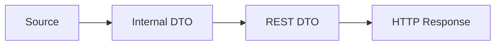

# [Work Item Title]

**ADO Work Item:** [#id](https://dev.azure.com/advantive-devops/0e254f90-a87c-479e-abde-680deb67b476/_workitems/edit/id)
**Date:** YYYY-MM-DD
**Assigned To:** [Assignee]
**Sprint:** [Sprint]
**Repository:** [repo-name] — `/home/laksyalamat/projects/[repo-name]`
**Java Version:** [11 / 17 / 25]
**Research Doc:** [ADO<id>-research-<datetime>.md](../research/ADO<id>-research-<datetime>.md)

---

## Summary

- **Tasks:** N
- **Files changed:** N
- **New tests:** N
- **Backward compatible:** Yes / No
- **Version bump required:** Yes / No

---

## Context

[One paragraph summarising the problem being solved and the NLA/consumer requirement driving it.
Derived from the research document — do not copy-paste verbatim; synthesise.]

---

## Data Flow



---

## Files Changed

| # | File | Change Type | Layer |
|---|---|---|---|
| 1 | `path/to/File.java` | Add / Modify / Delete | Model / Service / Controller / Test / Spec |

---

## Tasks

<!-- Each task follows the structure below. Order bottom-up: model first, tests last. -->

### Task 1 — [Short Action Title]

**File:** `path/to/File.java`
**Change type:** Add / Modify / Delete

#### What to change

[Precise description.]

#### Why

[One sentence linking to the requirement.]

#### Code

```java
// Before (omit if net-new)

// After / Add
```

#### Notes

[Null handling, edge cases, backward-compatibility constraints.]

---

### Task 2 — [Short Action Title]

**File:** `path/to/File.java`
**Change type:** Add / Modify / Delete

#### What to change

[To be completed]

#### Why

[To be completed]

#### Code

```java
// To be completed
```

#### Notes

[To be completed]

---

<!-- Add more Task sections as needed -->

---

## Backward Compatibility Assessment

| Interface | Change | Breaking? | Affected Consumers | Action Required |
|---|---|---|---|---|
| `ClassName.methodName()` | Added optional field | No | List of callers | None — additive |

---

## Test Plan

| Test Class | Test Method | What It Verifies |
|---|---|---|
| `TestXxx` | `testNewField_withData` | New field populated correctly |
| `TestXxx` | `testNewField_defaultsWhenNull` | Default value when source is null |

**Coverage targets:** 80% line / 70% branch (per project testing standards).

---

## Dependencies and Risks

| Item | Type | Notes |
|---|---|---|
| [Dependency name] | Dependency | e.g., module rebuild order |
| [Risk description] | Risk | e.g., null safety, legacy data |

---

## Out of Scope

- [Item not covered by this plan and why]
