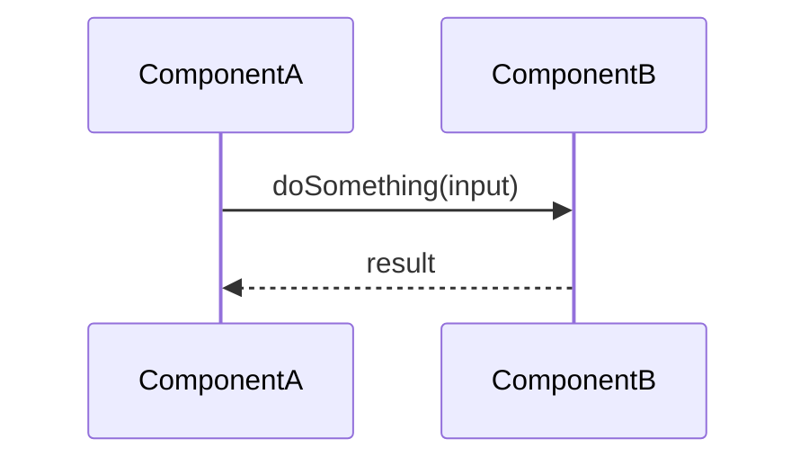

# PR Description Template

Use this template to produce the PR description document.
Populate every section using evidence from the PR diffs, work items, and comments.
Omit a section only if it genuinely does not apply — do not leave placeholder text.

---

## Document Header

```markdown
## PR #<pr-id> — <PR Title>

| Field | Value |
|---|---|
| **Status** | Active / Draft / Completed / Abandoned |
| **Author** | <display name> |
| **Branch** | `<source-branch>` → `<target-branch>` |
| **Created** | <DD Month YYYY> |
| **Linked Work Item** | [ADO-<id>](<url>) — <work item title> |
| **Merge Status** | Succeeded / Conflicts present / Not yet attempted |
| **Reviewers** | <names, or "None assigned"> |
```

---

## Summary Section

Write 2–4 sentences covering:

- The business or technical problem this PR solves.
- The approach taken (what was built or changed at a high level).
- Any significant constraints or design decisions.

Do NOT repeat the PR title verbatim. Add context and intent.

---

## What Changed Section

### Heading Rules

Use H3 (`###`) for each logical change group. Prefer intent-based groupings over file-by-file listing:

- **New Classes / Components**
- **Modified Files**
- **New Tests**
- **Configuration / Build Changes**
- **Sample / Reference Config Updates**

---

### New Classes / Components

For each new Java class, React component, script, or significant new file:

```markdown
#### `ClassName.java` (or `ComponentName.tsx`, `script.sh`, etc.)

- **Purpose**: One sentence: what this class/component/script does.
- **Behavior**: 3–6 bullet points describing the key logic, algorithm, or workflow. Infer from the diff — do not just restate method names.
- **Design decisions**: Note any non-obvious choices (e.g., why a `MapPropertySource` is added first, why an alternate main is used, why RSA+DES is non-deterministic, why a particular interface was chosen).
- **Security note** (if applicable): Call out any credential handling, input validation, or logging discipline relevant to this class.
```

---

### Modified Files

For each modified file, write a concise block:

```markdown
#### `path/to/File.java`

What was changed and **why**. Do not just say "updated". Explain the impact:
- Added X to enable Y.
- Removed Z because it was replaced by W.
- Changed layout from A to B to support the alternate entry point.
```

Keep each entry to 1–4 bullet points. If the modification is trivial (whitespace, import cleanup), group multiple trivial changes under a single heading.

---

### New Tests

List each new test class with its test methods and what each verifies:

```markdown
#### `TestClassName.java`

| Test | Verifies |
|---|---|
| `testMethodName_scenario_expectedOutcome` | <one-line description of what passes/fails and why it matters> |
| ... | ... |
```

If the test class covers a happy path, edge cases, and negative cases, note that explicitly — it signals good coverage discipline.

---

### Configuration / Build Changes

Describe pom.xml, build scripts, Spring Boot config, or infrastructure changes:

```markdown
#### `pom.xml`
- Added dependency `<groupId>:<artifactId>:<version>` — reason.
- Changed plugin configuration: `<what>` from `<old>` to `<new>` — reason.
```

---

### Sample / Reference Config Updates

When sample YAML, properties, or environment config files are updated:

```markdown
#### `sample/config-file-name`

Fields changed:
- `field.name`: Changed from `${ENV_VAR}` to `ENC(PLACEHOLDER)` — now uses encrypted value pattern. Operators must run `config-encrypt.sh` to generate real values.
```

---

## Architecture / Flow Diagram Section

Include a Mermaid diagram when the PR introduces or modifies a runtime flow, startup sequence, or multi-component interaction.

**Prefer a sequence diagram** for startup flows, request/response, and multi-step operations:



**Prefer a flowchart** for decision trees, branching logic, or data transformation pipelines.

**Omit** the diagram section if the PR is purely a configuration change, test-only addition, or trivial refactor with no new runtime flow.

---

## Open Items / Notes Section

Always include this section. Use it to surface:

```markdown
## Notes

- **Draft PR**: Not yet ready for review. [Reason if known from description or comments.]
- **Merge conflicts**: Conflicts against `<target-branch>` — must be resolved before merge.
- **No reviewers assigned**: Consider adding <suggested reviewers> based on ownership of changed modules.
- **Open reviewer comments**: <n> unresolved thread(s) — summarize topics if visible.
- **Deployment prerequisites**: [e.g., operators must run config-encrypt.sh and update linkcentral.yaml before deploying.]
- **Missing linked work item**: No ADO work item linked — consider linking to [ADO-<id>] if applicable.
- **Security flag**: [Any credential exposure, missing validation, or logging concern spotted in the diff.]
```

Only include items that apply. Do not output placeholder notes.

---

## Formatting Rules

- Use `backticks` for all file names, class names, method names, property keys, and shell commands.
- Use `**bold**` for field labels in tables.
- Use Mermaid fenced blocks (` ```mermaid `) for all diagrams — never ASCII art.
- Use tables for test listings and PR metadata.
- Do not include actual credential values, tokens, passwords, or encrypted bytes — even if they appear in the diff.
- Do not use emoji unless the PR description already contains them.
- Use past tense for what was done ("Added", "Changed", "Replaced") and present tense for behavior ("Decrypts", "Validates", "Returns").
